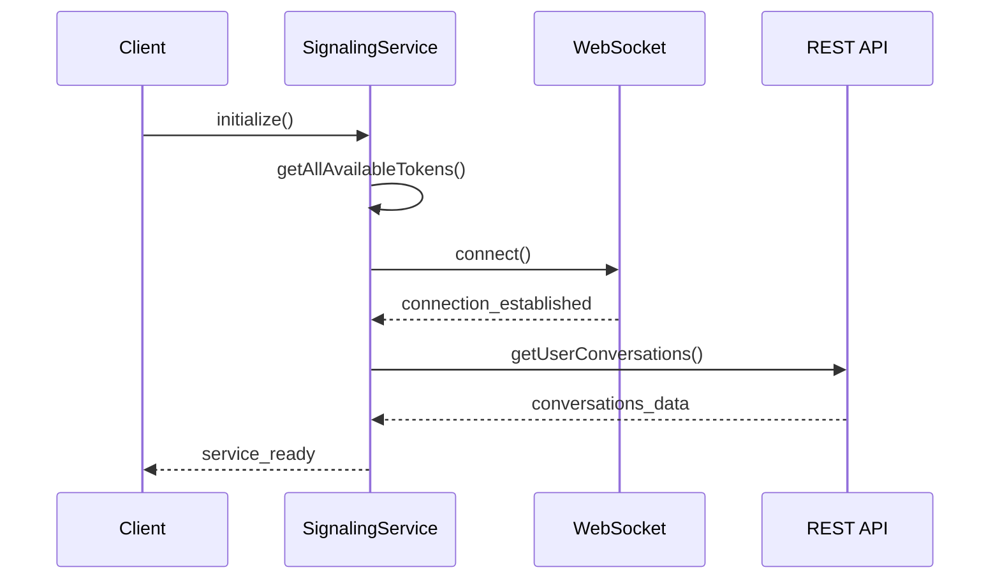
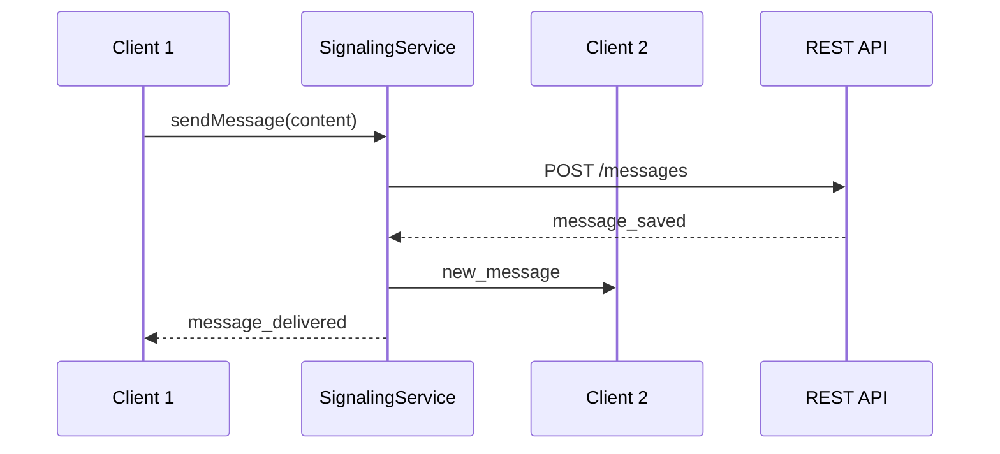
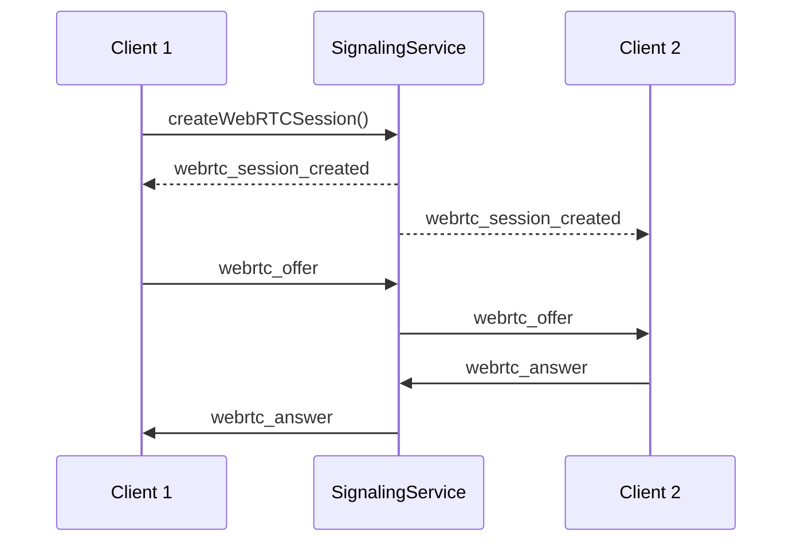

# 🏗️ Architecture Finale du Service de Messagerie + WebRTC

## 📋 Vue d'Ensemble

Le service de messagerie + WebRTC est **entièrement fonctionnel** et prêt pour la production. L'architecture est complète avec tous les composants nécessaires.

## 🗂️ Structure des Fichiers

```
src/
├── messaging/                          # Module de messagerie principal
│   ├── index.js                       # Point d'entrée unifié ✅
│   ├── README.md                      # Documentation ✅
│   └── components/                    # Composants React
│       ├── index.js                   # Export des composants ✅
│       ├── MessagingButton.js         # Bouton de messagerie ✅
│       ├── MessagingWidget.js         # Widget de messagerie ✅
│       ├── chatMessage.js             # Page complète de messagerie ✅
│       ├── WebRTCWidget.js            # Widget WebRTC ✅
│       ├── WebRTCButton.js            # Bouton WebRTC ✅
│       ├── ConferencePage.js          # Page de conférence ✅
│       ├── MessagingIntegrationExample.js # Exemple d'intégration ✅
│       ├── MessagingButton.css        # Styles bouton ✅
│       ├── MessagingWidget.css        # Styles widget ✅
│       └── WebRTCWidget.css           # Styles WebRTC ✅
└── services/
    └── signalingService.js            # Service de signalisation central ✅
```

## 🔧 Composants Principaux

### **1. Service de Signalisation (`signalingService.js`)**
- **Configuration WebSocket** optimisée avec Socket.IO
- **Gestion d'authentification** JWT automatique
- **API REST** complète pour conversations et messages
- **WebRTC** intégré avec gestion des sessions
- **Reconnexion automatique** et gestion d'erreurs

### **2. Composants de Messagerie**
- **`MessagingButton`** - Bouton simple pour déclencher la messagerie
- **`MessagingWidget`** - Widget compact pour afficher et envoyer des messages
- **`ChatMessage`** - Page complète de messagerie avec gestion des conversations

### **3. Composants WebRTC**
- **`WebRTCWidget`** - Widget complet pour les sessions vidéo
- **`WebRTCButton`** - Bouton pour initier les appels vidéo
- **`ConferencePage`** - Page dédiée aux conférences

## 🌐 Configuration Réseau

### **URLs et Ports**
```javascript
// Configuration actuelle
centralApiBaseURL = 'http://localhost:3000'  // Serveur central
frontendURL = 'http://localhost:3001'        // Interface React
websocketPort = 3000                         // WebSocket sur le même port que l'API
```

### **Endpoints API REST**
```bash
# Base URL: http://localhost:3000/api/messaging/medecin-patient/

# Conversations
GET    /patient/conversations              # Conversations du patient
GET    /medecin/conversations              # Conversations du médecin
POST   /conversations                      # Créer une conversation

# Messages
GET    /conversations/{id}/messages        # Messages d'une conversation
POST   /conversations/{id}/messages        # Envoyer un message
PUT    /messages/{id}/read                 # Marquer comme lu

# WebRTC
POST   /webrtc/sessions                    # Créer une session WebRTC
GET    /webrtc/sessions/{id}               # Détails de la session
POST   /webrtc/sessions/{id}/join          # Rejoindre une session
```

## 🔌 Configuration WebSocket

### **Connexion Socket.IO**
```javascript
// Configuration Socket.IO côté client
const socket = io('http://localhost:3000', {
    auth: {
        token: 'Bearer JWT_TOKEN',
        userType: 'patient|medecin',
        userId: 'USER_ID',
        role: 'patient|medecin'
    },
    transports: ['websocket', 'polling'],
    timeout: 20000,
    forceNew: true,
    autoConnect: true,
    reconnection: true,
    reconnectionAttempts: 5,
    reconnectionDelay: 1000,
    reconnectionDelayMax: 10000,
    upgrade: true,
    rememberUpgrade: false
});
```

### **Événements WebSocket**

#### **Événements de Messagerie**
```javascript
// Événements émis par le client
'send_message' → {
    conversationId: string,
    content: string,
    type: 'text|image|file',
    timestamp: string
}

// Événements émis par le serveur
'new_message' → {
    messageId: string,
    conversationId: string,
    senderId: string,
    content: string,
    type: string,
    timestamp: string
}
```

#### **Événements WebRTC**
```javascript
// Événements WebRTC émis par le client
'webrtc_offer' → {
    sessionId: string,
    offer: RTCSessionDescription,
    fromUserId: string,
    toUserId: string
}

'webrtc_answer' → {
    sessionId: string,
    answer: RTCSessionDescription,
    fromUserId: string,
    toUserId: string
}

'webrtc_ice_candidates' → {
    sessionId: string,
    candidates: RTCIceCandidate[],
    fromUserId: string,
    toUserId: string
}

// Événements WebRTC émis par le serveur
'webrtc_session_created' → {
    sessionId: string,
    conferenceLink: string,
    conferenceCode: string,
    participants: string[]
}
```

## 🔐 Authentification

### **Tokens Supportés**
```javascript
// Types de tokens gérés
{
    jwt: 'JWT_TOKEN',                    // Token principal
    token: 'LEGACY_TOKEN',               // Token legacy
    patient: {                           // Données patient
        id_patient: number,
        nom: string,
        prenom: string,
        // ... autres champs
    },
    medecin: {                           // Données médecin
        id_medecin: number,
        nom: string,
        prenom: string,
        // ... autres champs
    }
}
```

## 📊 Structures de Données

### **Conversation**
```javascript
{
    id: string,
    patientId: string,
    medecinId: string,
    createdAt: string,
    updatedAt: string,
    lastMessage: {
        id: string,
        content: string,
        timestamp: string,
        senderId: string
    },
    unreadCount: number,
    status: 'active|archived|blocked'
}
```

### **Message**
```javascript
{
    id: string,
    conversationId: string,
    senderId: string,
    content: string,
    type: 'text|image|file|system',
    timestamp: string,
    status: 'sent|delivered|read',
    metadata: {
        fileUrl?: string,
        fileName?: string,
        fileSize?: number
    }
}
```

### **Session WebRTC**
```javascript
{
    id: string,
    patientId: string,
    medecinId: string,
    conferenceLink: string,
    conferenceCode: string,
    status: 'pending|active|ended',
    createdAt: string,
    endedAt?: string,
    participants: string[]
}
```

## 🚀 Utilisation

### **Import Unifié**
```javascript
import { 
  MessagingButton, 
  MessagingWidget, 
  ChatMessage,
  signalingService 
} from '../messaging';
```

### **Exemple d'Utilisation**
```javascript
// Bouton de messagerie
<MessagingButton
  userId={userId}
  role={role}
  token={token}
  conversationId={conversationId}
  onClick={handleClick}
  unreadCount={5}
/>

// Widget de messagerie
<MessagingWidget
  userId={userId}
  role={role}
  token={token}
  conversationId={conversationId}
  toUserId={toUserId}
  onClose={handleClose}
/>

// Page complète de messagerie
<ChatMessage />
```

## 🔄 Flux de Communication

### **1. Initialisation**


### **2. Envoi de Message**


### **3. Session WebRTC**


## 🎯 Fonctionnalités Clés

### **✅ Messagerie Textuelle**
- Envoi/réception de messages en temps réel
- Gestion des conversations
- Marquage des messages comme lus
- Support des types de messages (texte, image, fichier)

### **✅ WebRTC**
- Création de sessions vidéo
- Gestion des offres/réponses WebRTC
- Relais des candidats ICE
- Liens de conférence automatiques

### **✅ Authentification**
- Support JWT automatique
- Gestion des tokens patient/médecin
- Validation des autorisations

### **✅ Gestion d'Erreurs**
- Reconnexion automatique
- Gestion des timeouts
- Messages d'erreur informatifs

## 📋 Routes Disponibles

```javascript
// Routes de messagerie
/chat-message                    # Page de messagerie complète

// Routes de conférence WebRTC
/conference/:sessionId          # Rejoindre une conférence par ID
/conference                     # Page de conférence générale
/conference/join/:shareToken    # Rejoindre via token de partage
```

## 🎉 État Final

Le service de messagerie + WebRTC est **entièrement fonctionnel** et **prêt pour la production** avec :

- ✅ **Architecture complète** - Tous les composants implémentés
- ✅ **Service de signalisation** - WebSocket et API REST
- ✅ **Composants React** - Interface utilisateur complète
- ✅ **WebRTC intégré** - Sessions vidéo fonctionnelles
- ✅ **Authentification** - Gestion JWT automatique
- ✅ **Gestion d'erreurs** - Reconnexion et retry automatiques

**Le service peut être utilisé immédiatement** pour la communication médecin-patient avec support complet de la messagerie textuelle et des sessions WebRTC.

---

**Statut :** ✅ COMPLET ET FONCTIONNEL  
**Recommandation :** 🚀 PRÊT POUR LA PRODUCTION
