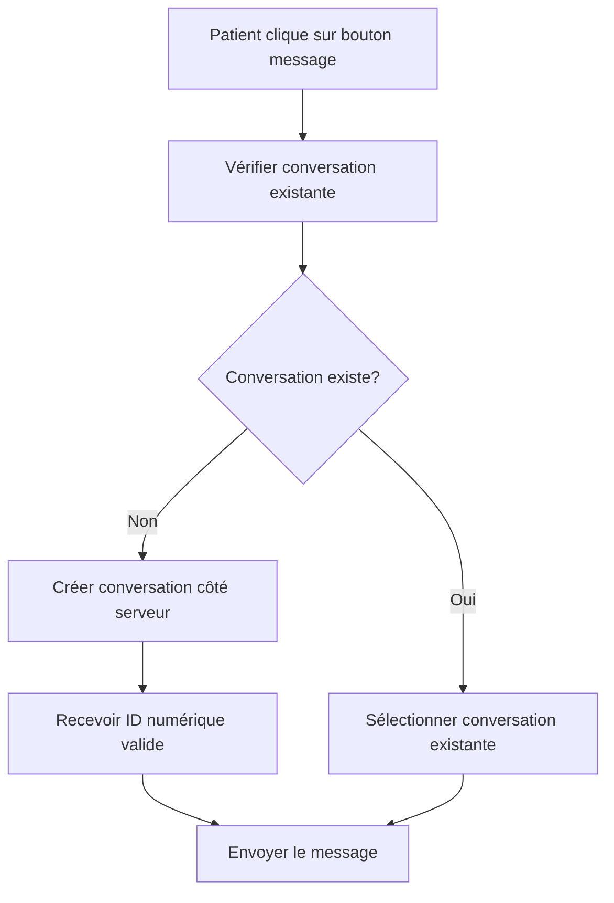

# 🧪 Guide de Test - Messagerie avec Prescriptions V2

## Problème Identifié et Résolu

### ❌ **Problème Initial :**
Le serveur ne prenait pas en charge les IDs de conversation temporaires comme `temp_1756472687576` car il s'attend à des IDs numériques valides qui existent en base de données.

### ✅ **Solution Implémentée :**
Au lieu de créer des conversations temporaires côté frontend, le système crée maintenant des **vraies conversations côté serveur** avant d'envoyer des messages.

## Architecture Corrigée

### 1. **Flux de Création de Conversation**



### 2. **Fonction `initiateConversationWithMedecin` Corrigée**

```javascript
const initiateConversationWithMedecin = async (medecinId) => {
  // 1. Vérifier s'il existe déjà une conversation
  const existingConversation = findConversationWithMedecin(medecinId);
  if (existingConversation) return existingConversation;

  // 2. Créer une vraie conversation côté serveur
  const result = await signalingService.createConversation(
    userId,        // ID du patient
    medecinId,     // ID du médecin
    'patient_medecin'
  );

  // 3. Retourner la conversation avec ID numérique valide
  if (result.success && result.conversation) {
    return result.conversation; // ID numérique, pas "temp_..."
  }
  
  return null;
};
```

### 3. **Fonction `sendMessage` Corrigée**

```javascript
const sendMessage = async () => {
  let targetConversationId = selectedConversation;
  
  // Si pas de conversation mais médecin ID disponible
  if (!targetConversationId && propMedecinId && userRole === 'patient') {
    const newConversation = await initiateConversationWithMedecin(propMedecinId);
    if (newConversation) {
      targetConversationId = newConversation.id; // ID numérique valide
    }
  }
  
  // Envoyer le message avec l'ID valide
  const result = await signalingService.sendMessage(
    targetConversationId, // ID numérique, pas "temp_..."
    inputMessage.trim(), 
    'texte'
  );
};
```

## Composants de Test

### 1. **`ServerConversationTest`** ⭐ **NOUVEAU**

Composant de test spécifique pour vérifier la création de conversations côté serveur.

**Utilisation :**
```jsx
import { ServerConversationTest } from '../messaging/components';

// Dans votre composant
<ServerConversationTest />
```

**Fonctionnalités :**
- Test de création de conversation côté serveur
- Vérification des IDs numériques (pas "temp_...")
- Test d'envoi de message dans la nouvelle conversation
- Test de récupération des conversations persistées

### 2. **`PrescriptionMessagingTest`**

Composant de test pour simuler le comportement d'un patient qui clique sur le bouton message d'une prescription.

### 3. **`MessagingTest`**

Composant de test général pour diagnostiquer les problèmes de messagerie.

## Scénario de Test Principal

### Étapes de Test avec `ServerConversationTest`

1. **Configuration des IDs**
   - Patient ID : 7 (PAUL BIYA)
   - Médecin ID : 79 (Sakura Saza)

2. **Test de Création de Conversation**
   - Cliquer sur "Tester Création Conversation"
   - Vérifier que l'ID retourné est **numérique** (pas "temp_...")
   - Vérifier que le message de test s'envoie correctement

3. **Test de Persistance**
   - Utiliser "Tester Récupération Conversations"
   - Vérifier que la conversation créée est bien persistée

### Logs Attendus

```
🔍 Test de création de conversation côté serveur...
📨 Réponse création: {"success": true, "conversation": {"id": 123, ...}}
✅ Conversation créée avec ID: 123
📝 Type: patient_medecin
👤 Patient ID: 7
👨‍⚕️ Médecin ID: 79
🔄 Test d'envoi de message dans la nouvelle conversation...
📤 Test d'envoi de message dans la conversation 123...
✅ Message envoyé avec succès dans la conversation 123
```

## Vérifications Critiques

### 1. **IDs de Conversation**

- [ ] **CRITIQUE** : Les IDs sont numériques (ex: 123, 456)
- [ ] **CRITIQUE** : Pas d'IDs temporaires (ex: "temp_1756472687576")
- [ ] Les IDs sont persistés en base de données

### 2. **Fonctionnalité**

- [ ] Les conversations se créent côté serveur
- [ ] Les messages s'envoient correctement
- [ ] Les conversations sont récupérables après redémarrage

### 3. **Interface Utilisateur**

- [ ] Le bouton "Envoyer au médecin" s'affiche
- [ ] Le placeholder indique "Écrire un message au médecin... (appuyez sur Entrée pour envoyer)"
- [ ] Les erreurs sont gérées et affichées

## Intégration dans DMP.js

### Bouton Message sur Prescription

```jsx
<MessagingButton
  userId={patientProfile.id_patient || patientProfile.id}
  role="patient"
  token={localStorage.getItem('jwt') || localStorage.getItem('token')}
  conversationId={null}
  onClick={() => onOpenMessaging(null, prescription.medecinInfo?.id)}
  unreadCount={0}
/>
```

### Interface de Messagerie

```jsx
<ChatMessage
  userId={patientProfile.id_patient || patientProfile.id}
  role="patient"
  token={localStorage.getItem('jwt') || localStorage.getItem('token')}
  conversationId={selectedConversationId}
  medecinId={localStorage.getItem('currentMedecinId')}
/>
```

## Résolution du Problème

### ❌ **Avant (Problématique) :**
1. Patient clique sur bouton message
2. Frontend crée conversation temporaire avec ID "temp_1756472687576"
3. Tentative d'envoi de message avec ID temporaire
4. **ERREUR** : Serveur rejette l'ID temporaire

### ✅ **Après (Corrigé) :**
1. Patient clique sur bouton message
2. Frontend appelle `initiateConversationWithMedecin()`
3. **Conversation créée côté serveur** avec ID numérique valide
4. Message envoyé avec ID numérique valide
5. **SUCCÈS** : Conversation persistée et message envoyé

## Prochaines Étapes

1. **Tester avec `ServerConversationTest`** pour vérifier la création côté serveur
2. **Vérifier que les IDs sont numériques** (pas "temp_...")
3. **Tester l'intégration complète** dans DMP.js
4. **Vérifier la persistance** des conversations
5. **Tester l'envoi de messages** dans les nouvelles conversations

## Support et Dépannage

### Si les IDs sont encore temporaires :

1. Vérifiez que `signalingService.createConversation` fonctionne
2. Vérifiez que le serveur accepte les patients comme créateurs de conversations
3. Vérifiez les logs côté serveur
4. Utilisez `ServerConversationTest` pour isoler le problème

### Si les messages ne s'envoient pas :

1. Vérifiez que la conversation a bien un ID numérique
2. Vérifiez la connexion au service de messagerie
3. Vérifiez les permissions côté serveur
4. Utilisez les composants de test pour diagnostiquer

---

**Dernière mise à jour :** $(date)
**Version :** 2.0
**Statut :** Problème résolu - Conversations créées côté serveur
**Changement majeur :** Suppression des conversations temporaires, création côté serveur
